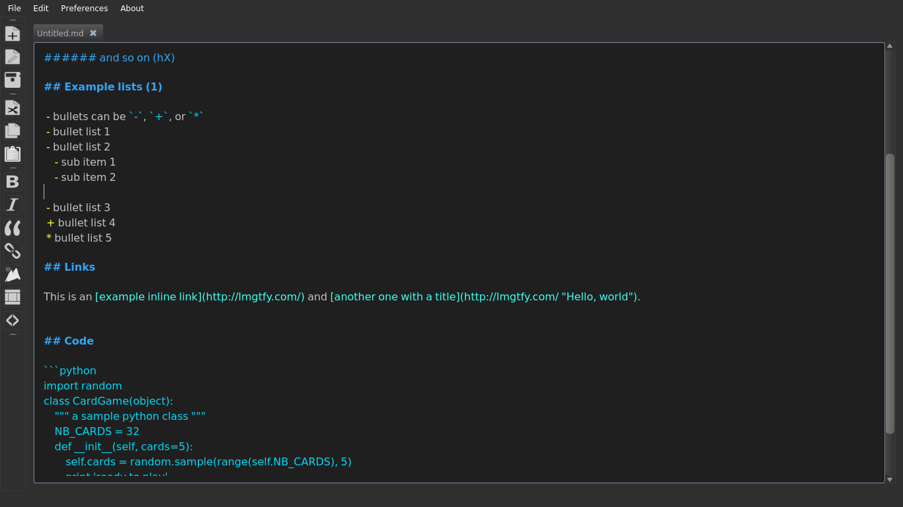
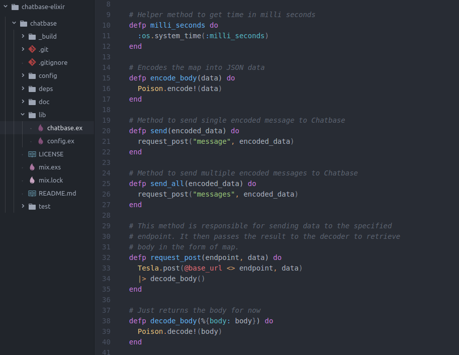



 

  

    

    <iframe src="https://www.youtube.com/embed/7Fy1_9NHIzY" frameborder="0" allowfullscreen></iframe>
    

  

  

    

    I am a computer science grad with experience in full stack web development and interest in cybersecurity. I have been actively contributing to open source projects from past 4 years, mostly developing in Ruby, PHP, JavaScript and Python. Apart from programming, I enjoy taking part in hackathons, CTF events, etc to enhance my knowledge of best practices in cyber security.
    Do check out my <a href="#featured-projects">projects</a> section.
    

    
Currently staying in
     
       Illinois,
       USA
     
    

  

 

  

    <h2>
    Social
    <a href="https://twitter.com/pytacular" class="twitter-follow-button" data-show-count="true" data-size="medium" data-lang="en">Follow @pytacular</a>
    </h2>
    

      <a href="https://github.com/{{ site.author.github }}" target="_blank"></a>
      <a href="https://www.linkedin.com/in/bhavyanshu/" target="_blank"></a>
      <a href="https://twitter.com/pytacular" target="_blank"></a>
      <a href="https://plus.google.com/112306240164215805986" rel="author" target="_blank"></a>
      <a href="http://bhavyanshu.me/subscribe.html" target="_blank"></a>
    

    
You won't find me on Facebook.
    You can visit <a href="/tags.html">tags section</a> to easily find topics of interest.

  

  

    <h2>Contact</h2>
    

    Got some work? Send email to <a href="mailto:mail@bhavyanshu.me">mail@bhavyanshu.me</a>  or if just wanna say hi, then write to <a href="bvyn@ya.ru">bvyn@ya.ru</a>
    

    

    0xCD1967F4FDF1A9AB - Verify at <a target="_blank" href="https://keybase.io/bhavyanshu">keybase.io</a> | <a href="https://pgp.mit.edu/pks/lookup?op=vindex&fingerprint=on&search=0xCD1967F4FDF1A9AB" target="_blank">pgp.mit.edu</a>
    

  

  <h2 id="featured-projects" class="text-center">Featured Projects</h2>
  

    

      
      
<a href="https://github.com/bhavyanshu/LightMd_Editor" target="_blank">LightMd Markdown Editor - FOSS</a>

      
Built in C & C++ Qt Framework

    

    

      

      

      
<a href="https://github.com/bhavyanshu/BoltCTF" target="_blank">BoltCTF - FOSS CTF hosting platform</a>

      
Built using Laravel & Vue.js Frameworks

    

    

      
      
<a href="https://github.com/bhavyanshu/Chatbase-elixir" target="_blank">Google's Chatbase Library- FOSS</a>

      
Built using Elixir

    

    

      

      

      
<a href="https://csc.uis.edu" target="_blank">Computer Science Dept. @ UIS</a>

      
Built using Ruby on Rails & Vue.js

    

    

      

      

      
<a href="http://csclub.uis.edu" target="_blank">Computer Science Club @ UIS</a>

      
Built on Drupal using Bootstrap Framework

    

    

      <a href="https://twitter.com/UISedu/status/925808247742914560" target="_blank">
      

      

      </a>
      
<a href="https://www.uis.edu/webservices/projects/alexa-skill/" target="_blank">Alexa Skills : UIS</a>

      
Built using Alexa SDK in Node.js

    

  

  

    <a class="btn btn-sm btn-primary margin-top" href="/projects.html">View More</a>
  

  

    <h2>My latest Posts</h2>
    <ul class="posts">
      
        <li>{{ post.date | date_to_string }} &raquo; <a href="{{ BASE_PATH }}{{ post.url }}">{{ post.title }}</a></li>
      
    </ul>
  

  

    <h2>Latest Tweets</h2>
    <a class="twitter-timeline" height="500" href="https://twitter.com/pytacular" data-widget-id="388676082561318912">Tweets by @pytacular</a>
  

